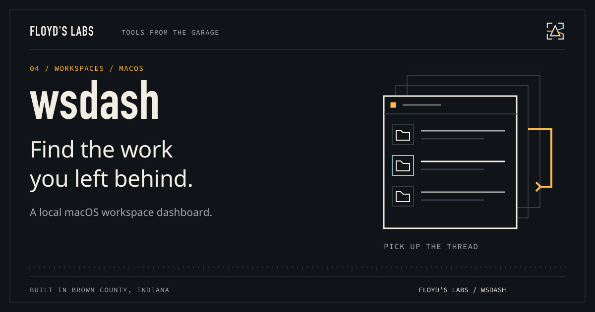

# wsdash



**Pick up the work you left behind.**

An on-demand workspace dashboard that scores Git changes, stale worktrees, failing tests, and unfinished work. Built at Floyd’s Labs: one garage, two black cats, and tools that have to earn the desk space.

[Download v0.2.0](https://github.com/CaptainPhantasy/wsdash/releases/tag/v0.2.0) · [Report a bug](https://github.com/CaptainPhantasy/wsdash/issues) · [Floyd’s Labs](https://floyd-labs-proving-ground.captainphantasy.chatgpt.site/open-source)

## Get it running

Requirements: **Python 3.11+ and Git; macOS for launchd integration**.

Download the wheel from the release, then install it in an isolated Python environment:

```sh
python3 -m venv .venv
.venv/bin/python -m pip install ./wsdash-0.2.0-py3-none-any.whl
.venv/bin/wsdash --version
.venv/bin/wsdash scan
.venv/bin/wsdash
```

No third-party Python packages are required for the core dashboard. `wsdash install` explicitly installs macOS launchd watchers and managed Git hooks; the ordinary dashboard runs on demand. Use `wsdash uninstall` to remove that integration. Scores describe unfinished work, not project quality. Deep filesystem changes may rely on Git hooks or cache expiry because WatchPaths is shallow.

Optional LLM/chat features need your own provider credentials and can send selected context to that provider. Review [Security](docs/SECURITY.md), [Configuration](docs/CONFIGURATION.md), and [Known Issues](KNOWN_ISSUES.md) before enabling them.

## What is in the box

The release includes `wsdash-0.2.0-py3-none-any.whl`, source where applicable, and `SHA256SUMS.txt`. Use the tagged release's named assets for installation; GitHub's automatic source archives are snapshots. Verify a download with `shasum -a 256 -c SHA256SUMS.txt` after downloading the matching files.

## Show the work

`python3 -m unittest discover -s tests -v` checks workspace scoring, state storage, CLI, and stubbed LLM/MCP behavior. The wheel is separately installed and run in a fresh virtual environment. Paid provider calls are not part of the suite.

## Contribute or get help

Open an issue with your platform, version, command, and a minimal reproduction. Keep credentials and personal transcripts out of reports. See [CONTRIBUTING.md](CONTRIBUTING.md) and [SECURITY.md](SECURITY.md).

## License

The repository has no open-source license granting redistribution rights. Existing restrictions are preserved; a public download does not change those rights.

---

Built with intent. Bella checks the keyboard. Bowser watches the router.
